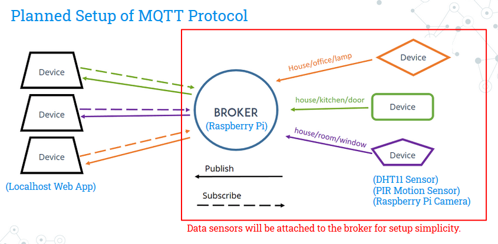
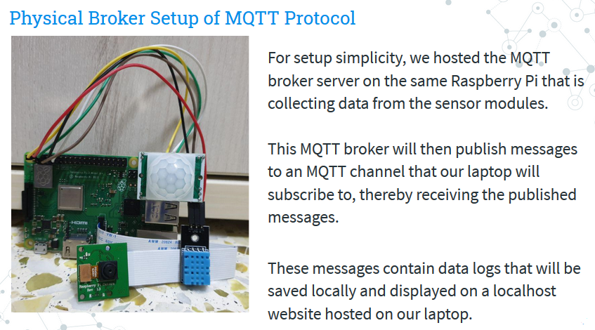
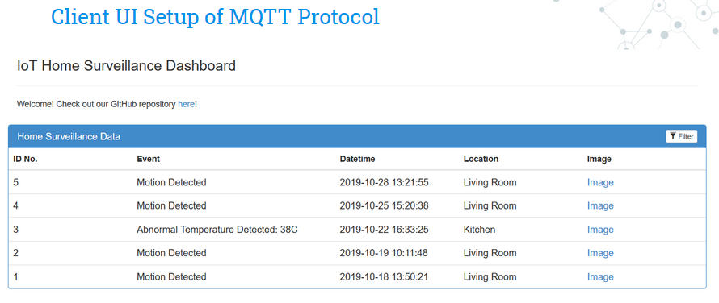

# MQTT HomeSecure

## Home Surveillance via Data Sensors using MQTT Protocol

The aim of this project was to set up a home surveillance system using sensors that can send data messages to alert homeowners of suspicious activities like 
unexpected motions (e.g. intruders) or abnormal temperatures (e.g. fire) and sends them an image so that they can monitor the situation remotely.

## Our Setup

### Planned Setup


### Physical Setup


### Client UI Setup


### Hardware Used

1. Raspberry Pi
2. Micro SD Card with Raspberry Pi OS image installed
2. F/F Jumper Wires
3. HC-SR501 Infrared PIR Motion Sensor Module
4. DHT11 Temperature & Humidity Sensor Module
5. Raspberry Pi Camera Module

### Software Used
 
1. Python 3.7.0  
2. Python Libraries  
* [RPi.GPIO](https://pypi.org/project/RPi.GPIO/) - GPIO Control on a Raspberry Pi  
* [Eclipse Mosquitto](https://mosquitto.org/) - Helps to set up MQTT Broker 
* [Eclipse Paho MQTT Python Client Library](https://pypi.org/project/paho-mqtt/) - Client Class for MQTT Protocol   
* [picamera](https://pypi.org/project/picamera/) - Raspberry Pi Camera Module  

Install prerequisite Python libraries with pip:  
```
pip install -r requirements.txt  
```

### RPi GPIO Setup

#### DHT11 Temperature & Humidity Sensor
GCC - GPIO Pin 2  
Data - GPIO Pin 7  
GND - GPIO Pin 9  
#### HC-SR501 PIR Sensor
GCC - GPIO Pin 4  
Data - GPIO Pin 11  
GND - GPIO Pin 6  

## Setting Up and Running the Program

1. Install Mosquitto MQTT Broker

```
sudo apt update
sudo apt install -y mosquitto
```

2. Set up Mosquitto MQTT Broker using default configurations.

```
sudo systemctl enable mosquitto.service
mosquitto -v
```

3. Start collecting data on the MQTT Broker (i.e. the Raspberry Pi) and publishing messages to your MQTT Client Machine (e.g. desktop, laptop, etc.) by using the following command in the `src/broker` directory:

```
python mqtt_publisher.py
```

4. Subscribe to MQTT Broker (i.e. the Raspberry Pi) on your MQTT Client Machine (e.g. desktop, laptop, etc.) using the following command in the `src/client` directory:

```
python mqtt_subscriber.py
```

5. Data (i.e. data logs and images) will be saved locally in the `src/client/localhost/public/data` directory.

6. Alternatively, users may view the data on a deployed Node.js page found in the `src/client/localhost` directory.  
Use the following commands to set up the page on `http://localhost:3000`.  

```
npm install
node index
```

The credentials for logging in to the dashboard are:
```
Username: admin  
Password: cs3103rocks  
```

## Logic Model

1. If motion sensor detects motion, it publishes a data log to the MQTT broker.
2. If temperature sensor detects an abnormally high temperature, it publishes a data log to the MQTT broker.
3. In the cases of both (1) and (2), a snapshot image will be taken and sent to the client's webpage for remote access.
4. Client can view webpage for logged data when there is detected motion or abnormal temperature in the house.
5. Client can further verify if logged data were false alarms or not by checking the images captured in (3).

## Basic Features

1. Data collection (logs and images) from sensor modules (RPi Camera, PIR Motion, Temperature and Humidity).   
2. Format JSON objects from collected data.  
3. MQTT protocol from MQTT broker and data sensors to MQTT client.  
4. Storage of data logs and captured images from data sensors.  
5. UI for displaying logged data on localhost website.  
6. Enhanced messaging reliability and persistence with MQTT protocol.  
   * Disconnected clients can still receive lost messages sent during the disconnection upon reconnecting
7. Configured Mosquitto MQTT broker to use TLS security protocol.  
   * Provides end-to-end communications security over MQTT protocol to prevent eavesdropping, tampering and message forgery
   * Requires personalized setup by users (refer to the TLS Security section)
8. Record videos, upload onto Dropbox and send alert email notifications with the video link included.  

### Enhanced Messaging Reliability and Persistence
This was set up by ensuring client had a unique client_id that can be identified by the broker as an existing subscriber.
Client also has to disable the `clean_session` option by setting it to false and subscribe to channels with a specified `qos` level of either 1 or 2.
Broker has to publish messages with `qos` option set to either 1 or 2.

### TLS Security
Setting up TLS protocol would require the user to make use of `openssl` to create his/her own Certificate Authority, Server keys and certificates.
The instructions can be found in the `tls-setup` folder.

## Possible Further Enhancements
1. Combination of MQTT protocol with other protocols to further improve the system. 
For instance, RTP/RTSP can allow us to stream live videos that can enable clients to view real-time footages and provide quick responses.
2. Deploy website for clients’ remote access over the Internet.

## Authors

* **Tan Yong He** - [tanyonghe](https://github.com/tanyonghe)
* **Lou Shaw Yeong** - [xiaoyeong](https://github.com/xiaoyeong)
* **Ng Jian Wei** - [njw95](https://github.com/njw95)
* **Eshwar S/O Kamalapathy** - [eshwarkp](https://github.com/eshwarkp)

## References

* [HiveMQ MQTT Blog Posts](https://www.hivemq.com/tags/mqtt-essentials/)
* [Mosquitto SSL Configuration - MQTT TLS Security](http://www.steves-internet-guide.com/mosquitto-tls/)
